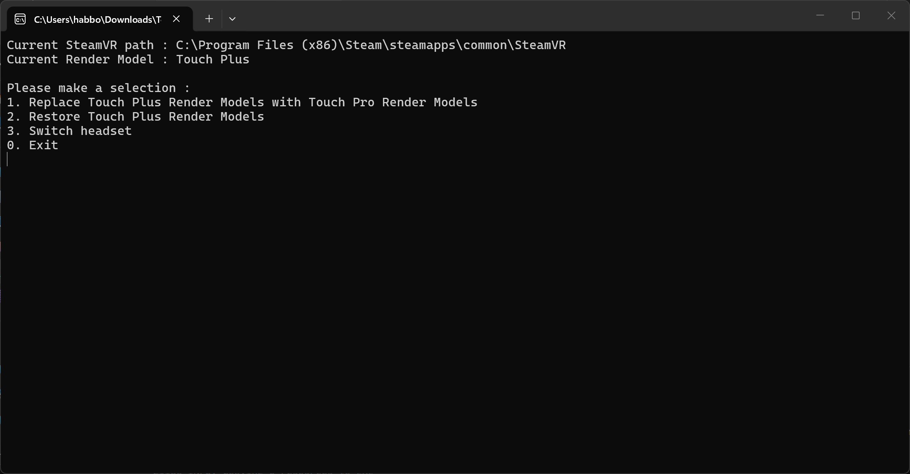

# SteamVR-RenderModelSwitcher

Have you ever used Quest Pro controllers on a Quest 2 or Quest 3, but got annoyed that they don't show as Quest Pro controllers in SteamVR ?
Or, you have Vive Controllers 2.0, but they still show up as Vive Controllers 1.0 in SteamVR ?  
...Yes? Well that's exactly for you.

SteamVR-RenderModelSwitcher is a Python made tool that lets you switch between different SteamVR 3D models.

### What it includes

It includes :
- Switching from Quest 2 controllers to Quest Pro controllers
- Switching from Quest 3 controllers to Quest Pro controllers
- Switching from Vive Controllers 1.0 to Vive Controllers 2.0

## Usage

*Note : This tool assumes that you're on Windows. It has not been tested on Linux and may not even work.*

Download the tool from the releases and execute it.

You can navigate with numbers and by pressing on Enter.

Note : some SteamVR updates can replace the models to their default state, and the program may not say the correct model type. Just do one of the 2 actions and it should set everything back to normal.

# Attribution and Thanks

Special thanks to :

- [Blair](https://steamcommunity.com/id/blair2819) who did the custom Blue textures for the Vive controllers
